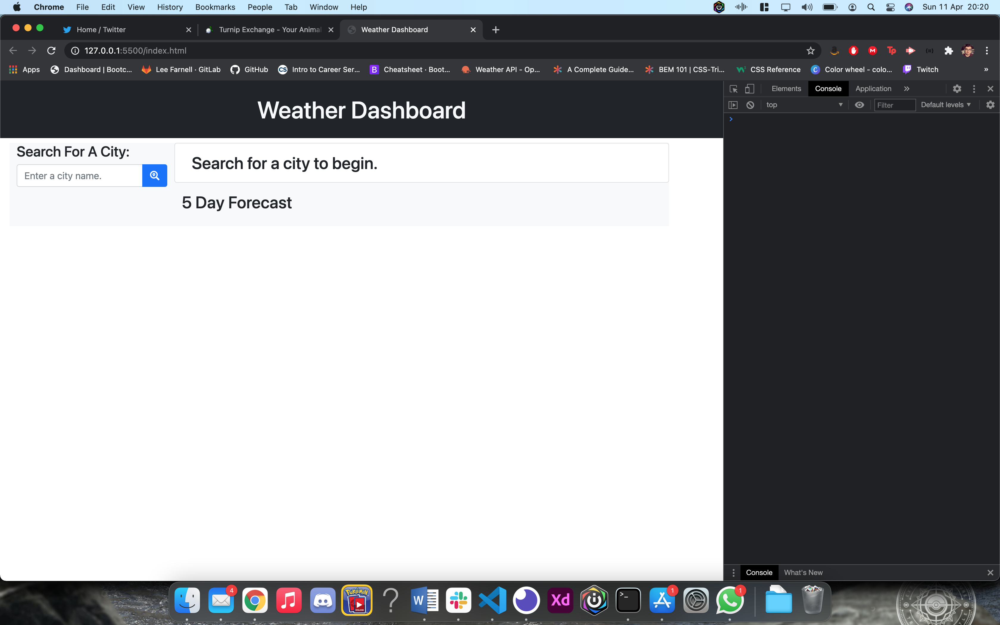
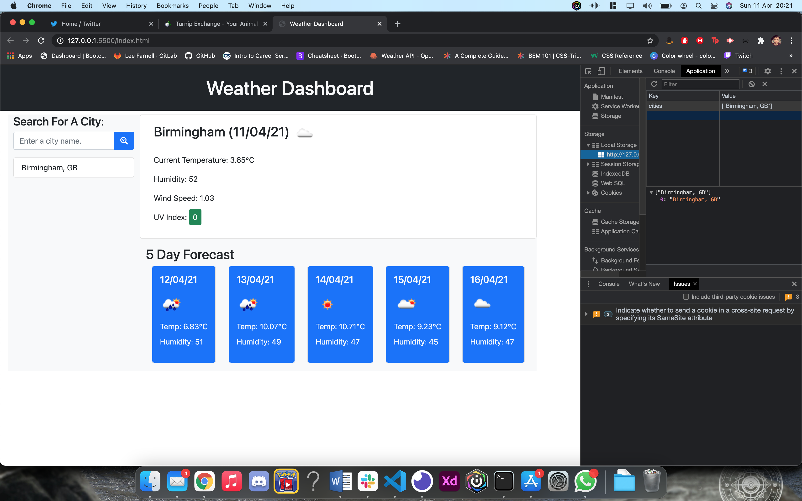
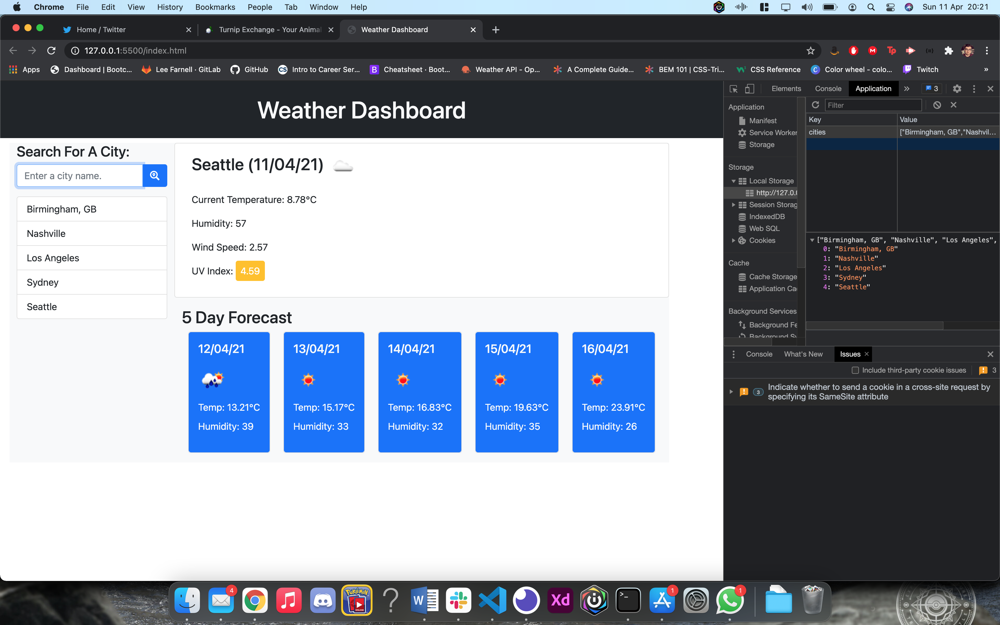

## Weather Dashboard

For this project, we were set a task to create a fully working weather dashboard, which would pull data from a weather API when the user searched for a particular city.

The data that had to be returned included:

- Current weather for that city, including the temperature, wind speed, humidity and UV index.
- An icon to reflect the current weather.
- A colour coded UI index to show the level as good, moderate or severe
- The forecast for the next 5 days, which also included key information
- Recent searches also had to be added to local storage and be able to be called upon again later.

All this information could be obtained from one API source, however, 2 calls needed to be made as you could only obtain certain information which was needed via a certain API.

This project was a real challenge for me and tested me more than any previous project I have faced as part of the coding boot camp. Whilst I understood the project and how I needed to obtain that information, I had real issues when it came down to putting all the pieces together and get the app fully working.

One of the folders in here is called "old code". These are my workings through this project before I initially started from scratch, as I had encountered many issues with my code and found no alternative way out. I understand this is not best practice and had I had more time to complete this project, I would of probably been able to get my original code in working order.

Starting the project from scratch enabled me to go through the code more carefully and gain an understanding of how the pieces joined together and how the dashboard worked over all.

## Deployed Link

https://leefarnell.github.io/Weather_Dashboard/

## Screenshots

